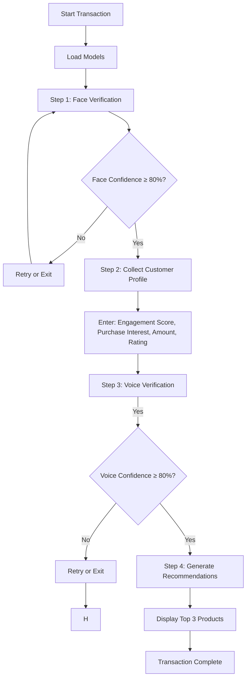

# Biometric Transaction Verification System

A comprehensive multi-factor authentication system that combines **face recognition**, **voice verification**, and **AI-powered product recommendations** for secure transaction processing.

## Overview

This system provides a secure, three-step authentication and recommendation process:

1. **Face Verification** - Identifies user from facial image
2. **Customer Profile Collection** - Gathers transaction parameters
3. **Voice Verification** - Confirms identity through voice authentication
4. **Product Recommendations** - Provides personalized AI-powered product suggestions

---

## Features

### Security

- **Multi-factor authentication** (Face + Voice)
- **Identity matching enforcement** - Voice must match face identity
- **80% confidence threshold** for both biometric verifications
- **Real-time security alerts** for mismatches

### Product Recommendations

- **AI-powered suggestions** based on customer profile
- **Top 3 recommendations** with confidence scores
- **Personalized** based on engagement, purchase history, and ratings

### User Experience

- **Color-coded terminal output** for better readability
- **Interactive prompts** with clear guidance
- **Retry mechanisms** for failed verifications
- **Detailed transaction summaries**

---

## 📦 System Requirements

### Required Models

The system requires the following pre-trained models:

```
/content/rf_image_member_classifier.joblib    # Face recognition model
/content/rf_feature_scaler.joblib             # Image feature scaler
/content/rf_label_encoder.joblib              # Image label encoder
/content/voiceprint_model.joblib              # Voice recognition model
/content/product_recommendation_model.joblib   # Product recommendation model
/content/merged_dataset.csv                    # Customer data
```

### Python Dependencies

```python
opencv-cv2
numpy
pandas
joblib
librosa
soundfile
```

---

## 🚀 Installation

### Local Environment

1. **Install dependencies**:

```bash
pip install opencv-python numpy pandas joblib librosa soundfile
```

2. **Update model paths** in the script configuration section
3. **Run the script**:

```bash
python script.py
```

---

## 🔄 How It Works

### Step-by-Step Process



### Authentication Flow

#### 1️⃣ Face Verification

- System loads face image
- Extracts 103 facial features (color histograms, textures, edges)
- Predicts identity using Random Forest classifier
- Displays confidence breakdown for all members
- **Requirement**: Confidence ≥ 80%

#### 2️⃣ Customer Profile Input

User provides transaction parameters:

- **Engagement Score** (0-100): Customer engagement level
- **Purchase Interest Score** (0-10): Interest in products
- **Purchase Amount** ($): Expected purchase value
- **Customer Rating** (0-5): Customer satisfaction rating
- **Optional**: Age, Monthly Visits, Total Transactions

#### 3️⃣ Voice Verification

- System loads voice audio file
- Extracts 40 audio features (MFCCs, spectral features, energy, tempo)
- Predicts identity using trained voice model
- **Critical**: Voice identity MUST match face identity
- **Requirement**: Confidence ≥ 80%

#### 4️⃣ Product Recommendations

- Uses customer profile parameters
- Random Forest model predicts product categories
- Displays top 3 recommendations with confidence scores
- Shows complete probability distribution

---

### Confidence Thresholds

Both biometric verifications require **≥80% confidence**:

- Below threshold → Verification fails
- User can retry with different samples
- Multiple failures → Transaction aborted

### Retry Mechanism

After failed verification:

```
⚠ Confidence too low! Required: 80%, Got: 75.50%
✗ Face verification FAILED

Try another image? (yes/no):
```

---

## 📁 File Structure

```
biometric-transaction-system/
│
├── script.py          # Main application script
│
├── models/
│   ├── rf_image_member_classifier.joblib       # Face recognition
│   ├── rf_feature_scaler.joblib                # Image scaler
│   ├── rf_label_encoder.joblib                 # Image encoder
│   ├── voiceprint_model.joblib                 # Voice recognition
│   └── product_recommendation_model.joblib     # Product recommendations
│
├── data/
│   └── merged_dataset.csv                      # Customer profiles
│   ├── Hortance-smiling.jpg
│   ├── John-normal.jpg
│   └── Marie-surprised.jpg
│   ├── Hortance-approve.mp3
│   ├── John-confirm.wav
│   └── Marie-approve.m4a
│
└── README.md                                   # This file
```
